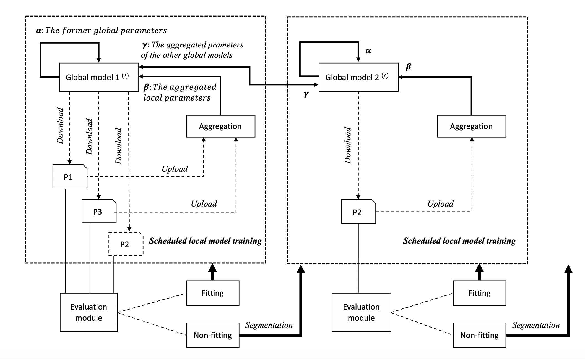

# Segmented Federated Learning

This is an implementation of the 2020 IJCNN paper [Intrusion Detection with Segmented Federated Learning for Large-Scale Multiple LANs](https://ieeexplore.ieee.org/document/9207094).

## Table of Contents
* [General information](#general-information)
* [Setup instructions](#setup-instructions)
* [Running the systems](#running-the-systems)
* [Further readings](#further-readings)


## General information
Predominant network intrusion detection systems (NIDS) aim to identify malicious traffic patterns based on a handcrafted dataset of rules. Recently, the application of machine learning in NIDS helps alleviate the enormous effort of human observation. Federated learning (FL) is a collaborative learning scheme concerning distributed data. Instead of sharing raw data, it allows a participant to share only a trained local model. Despite the success of existing FL solutions, in NIDS, a network’s traffic data distribution does not always fit into the single global model of FL; some networks have similarities with each other but other networks do not. We propose Segmented-Federated Learning (Segmented-FL), where by employing periodic local model evaluation and network segmentation, we aim to bring similar network environments to the same group.

<p align="center">

</p>

## Setup instructions
This is a quick guide to get started with the sources. 
### Dependencies 
You will need [Python 3](https://www.python.org/downloads/) to run the systems. 

Upgrade pip to the latest version, use:

    sudo python3 -m pip install --upgrade pip

### Forking or cloning
Consider ***forking*** the project if you want to make changes to the sources. If you simply want to run it locally, you can simply ***clone*** it.

#### Forking
If you decide to fork, follow the [instructions](https://help.github.com/articles/fork-a-repo) given by github. After that you can clone your own copy of the sources with:

    git clone https://github.com/YOUR_USER_NAME/homogeneous-learning.git

Make sure you change *YOUR_USER_NAME* to your user name.

## Running the systems
First, please download the [Segmented Intrusion Detection Dataset (SIDD)](https://www.kaggle.com/datasets/yuweisunut/sidd-segmented-intrusion-detection-dataset). Place the unzipped files at the following location in the root dir to form the following tree structure:

    |-- Segmented-FL
        |-- main.py
        |-- cnn
        |-- n005
        |  |-- pcap
        |  |-- local.npy
        |-- n006
        |  |-- pcap
        |  |-- local.npy
        |-- ...


Then, the algorithm can be run by simply typing:

    python main.py  
  
## Segmented Intrusion Detection Dataset (SIDD)
[SIDD](https://www.kaggle.com/datasets/yuweisunut/sidd-segmented-intrusion-detection-dataset) is the first image-based network intrusion detection dataset. This large-scale dataset includes the feature maps (images) of network traffic data from 15 different observation locations of different countries in Asia. This dataset is used to identify two different types of anomalies from benign network traffic. Each image with a size of 48 × 48 contains multi-protocol communications within 128 seconds. The SIDD dataset can be to applied to a broad range of tasks such as machine learning-based network intrusion detection, non-iid federated learning, and so forth.

- The folders in the dataset are named as> **node name\_collection date\_device id\_anomaly type**. For example, **n005\_20191001\_000001\_1** means the traffic data including **Type A anomaly** collected on **October 1, 2019** by device id 1 at **node 005**.  

- In each folder, traffic data images were separated into the benign and anomaly. 

- Currently, we are providing the images of two types of anomaly:
     
     - Type A: Server Message Block (SMB) attack (folder names like xx\_xx\_xx\_1)
     
     - Type B: TCP SYN flood attack (folder names like xx\_xx\_xx\_3)


## Citation
If this repository is helpful for your research or you want to refer the provided results in this work, you could cite the work using the following BibTeX entry:

```
@inproceedings{sun2020segmented,
  author    = {Yuwei Sun and
               Hideya Ochiai and
               Hiroshi Esaki},
  title     = {Intrusion Detection with Segmented Federated Learning for Large-Scale
               Multiple LANs},
  booktitle = {International Joint Conference on Neural Networks (IJCNN)},
  year      = {2020}
}
```

## Further readings
### Segmented Federated Learning
* [	Adaptive Intrusion Detection in the Networking of Large-Scale LANs with Segmented Federated Learning](https://ieeexplore.ieee.org/stamp/stamp.jsp?tp=&arnumber=9296578), Sun et al.,IEEE Open Journal of the Communications Society, Vol.2, pp.102-112. 2020.

### Decentralized ML
* [Decentralized Deep Learning for Multi-Access Edge Computing: A Survey on Communication Efficiency and Trustworthiness](https://www.techrxiv.org/articles/preprint/Decentralized_Deep_Learning_for_Multi-Access_Edge_Computing_A_Survey_on_Communication_Efficiency_and_Trustworthiness/16691230), Yuwei Sun et al., IEEE Transactions on Artificial Intelligence (2022).  
* [Homogeneous Learning: Self-Attention Decentralized Deep Learning](https://ieeexplore.ieee.org/document/9680704), Yuwei Sun and Hideya Ochiai, IEEE Access (2022).
