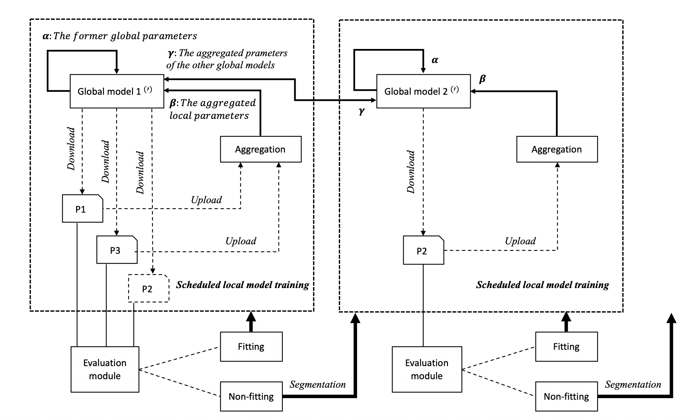

## This is an implementation of the 2020 IJCNN paper [Intrusion Detection with Segmented Federated Learning for Large-Scale Multiple LANs](https://ieeexplore.ieee.org/document/9207094)
## Table of Contents
* [General information](#general-information)
* [Setup instructions](#setup-instructions)
* [Running the systems](#running-the-systems)
* [Further readings](#further-readings)

## General information
Predominant network intrusion detection systems (NIDS) aim to identify malicious traffic patterns based on a handcrafted dataset of rules. Recently, the application of machine learning in NIDS helps alleviate the enormous effort of human observation. Federated learning (FL) is a collaborative learning scheme concerning distributed data. Instead of sharing raw data, it allows a participant to share only a trained local model. Despite the success of existing FL solutions, in NIDS, a network’s traffic data distribution does not always fit into the single global model of FL; some networks have similarities with each other but other networks do not. We propose Segmented-Federated Learning (Segmented-FL), where by employing periodic local model evaluation and network segmentation, we aim to bring similar network environments to the same group.

## Setup instructions
This is a quick guide to get started with the sources. 
### Dependencies 
You will need [Python 3](https://www.python.org/downloads/) to run the systems. 

Upgrade pip to the latest version, use:

    sudo python3 -m pip install --upgrade pip

### Forking or cloning
Consider ***forking*** the project if you want to make changes to the sources. If you simply want to run it locally, you can simply ***clone*** it.

#### Forking
If you decide to fork, follow the [instructions](https://help.github.com/articles/fork-a-repo) given by github. After that you can clone your own copy of the sources with:

    git clone https://github.com/YOUR_USER_NAME/homogeneous-learning.git

Make sure you change *YOUR_USER_NAME* to your user name.

## Running the systems
The algorithm can be run by simply typing:

    python3 main.py
    

## Further readings
### Segmented Federated Learning
* [	Adaptive Intrusion Detection in the Networking of Large-Scale LANs with Segmented Federated Learning](https://ieeexplore.ieee.org/stamp/stamp.jsp?tp=&arnumber=9296578), Sun et al.,IEEE Open Journal of the Communications Society, Vol.2, pp.102-112. 2020.

### Decentralized ML
* [Decentralized Deep Learning for Multi-Access Edge Computing: A Survey on Communication Efficiency and Trustworthiness](https://www.techrxiv.org/articles/preprint/Decentralized_Deep_Learning_for_Multi-Access_Edge_Computing_A_Survey_on_Communication_Efficiency_and_Trustworthiness/16691230), Yuwei Sun et al., IEEE Transactions on Artificial Intelligence (2022).  
* [Homogeneous Learning: Self-Attention Decentralized Deep Learning](https://ieeexplore.ieee.org/document/9680704), Yuwei Sun and Hideya Ochiai, IEEE Access (2022).
